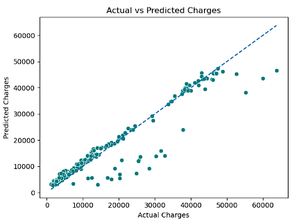
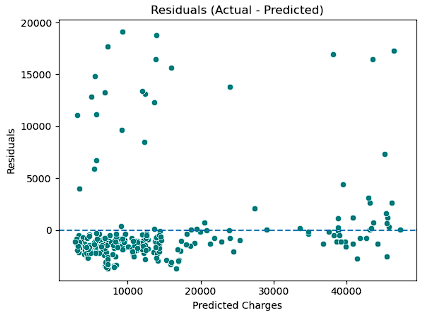
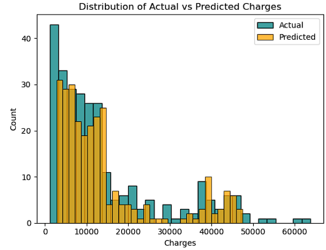

# 💰 Insurance Charges Prediction – End-to-End ML Application


An end-to-end **Machine Learning Regression system** to predict **insurance charges**, deployed with **FastAPI**, **Streamlit**, and automated using **CI/CD pipelines**.

---

## 🚀 Live Application
- **Frontend (Streamlit UI):** https://insurance-streamlit-app.onrender.com

- **Backend API (FastAPI):**  https://insurance-backend-api.onrender.com

---

## 📌 Project Overview

This project demonstrates a **production-ready ML lifecycle**, from data preprocessing to cloud deployment with CI/CD.

### Key Objectives:
- Predict insurance charges accurately
- Build scalable ML APIs
- Deploy a full-stack ML system
- Automate testing & deployment

---

## 🧠 Machine Learning Pipeline

### 🔹 Problem Type
- Regression

### 🔹 Target Variable
- `charges`

### 🔹 Final Feature Set
age, sex, bmi, children, smoker,
bmi_smoker_numeric,
region_southeast,
bmi_category_Normal,
bmi_category_Overweight,
bmi_category_Obese,
AgeGroup_Senior 


### 🔹 Feature Engineering
- One-hot encoding for categorical features
- BMI category bucketing
- Smoker–BMI interaction feature
- Age group binning

---

## 🤖 Model Training & Evaluation

### Models Evaluated
- Linear Regression
- Random Forest Regressor
- **XGBoost Regressor (Final)**

### Final Model Performance
- **R² Score ≈ 90%**
- Low residual bias
- Strong generalization on test data

### Evaluation Metrics
- R² Score
- RMSE
- Residual Analysis
- Distribution comparison (Actual vs Predicted)

---

## 📊 Model Diagnostics

### 🔹 Actual vs Predicted


### 🔹 Residual Analysis


### 🔹 Distribution Comparison


---

## 🧩 Backend – FastAPI

### API Endpoints

| Method | Endpoint | Description |
|------|--------|------------|
| GET | `/` | Health check |
| POST | `/predict` | Predict insurance charges |

### Backend Stack
- FastAPI
- Pydantic
- XGBoost
- Scikit-learn
- Joblib

---

## 🎨 Frontend – Streamlit

### Features
- Interactive sliders & dropdowns
- Backend retry logic (Render free-tier cold starts)
- Real-time prediction display

---

## ☁️ Deployment (Render)

- Backend and frontend deployed as **separate Render Web Services**
- Auto-deployment enabled via GitHub integration

---

## 🔁 CI/CD Pipeline (GitHub Actions)

### Workflow
Git Push → GitHub Actions (CI) → Render Auto Deployment (CD) 


### CI Responsibilities
- Dependency installation
- Import validation
- Deployment safety checks

✅ No API tokens required due to Render’s GitHub-native deployment

---

## 🧰 Tech Stack

- **Language:** Python
- **ML:** Pandas, NumPy, Scikit-learn, XGBoost
- **Backend:** FastAPI, Uvicorn
- **Frontend:** Streamlit
- **DevOps:** GitHub Actions, Render
- **Version Control:** Git, GitHub

---

## 🏁 How to Run Locally

### Backend

```bash
cd backend
pip install -r requirements_backend.txt
uvicorn main:app --reload
```

### Frontend

```bash
cd frontend
pip install -r requirements_frontend.txt
streamlit run app.py 
``` 

---

## 📈 Future Enhancements

- SHAP-based explainability
- Authentication & rate limiting
- Dockerization
- Monitoring & logging
- Automated retraining pipelines

---

## 👤 Author

**Tanu Dewangan**  
Machine Learning | Data Science | End-to-End ML Systems
